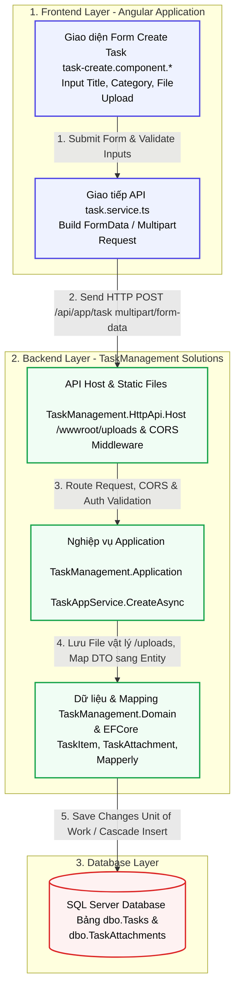

```mermaid
graph TD
    classDef frontend fill:#eef2ff,stroke:#4f46e5,stroke-width:2px,color:#000000;
    classDef backend fill:#f0fdf4,stroke:#16a34a,stroke-width:2px,color:#000000;
    classDef db fill:#fef2f2,stroke:#dc2626,stroke-width:2px,color:#000000;

    subgraph Frontend [1. Frontend Layer - Angular Application]
        UI[Giao diện Form Create Task <br/> task-create.component.* <br/> Input Title, Category, File Upload]
        Service[Giao tiếp API <br/> task.service.ts <br/> Build FormData / Multipart Request]
        
        UI -->|1. Submit Form & Validate Inputs| Service
    end

    subgraph Backend [2. Backend Layer - TaskManagement Solutions]
        Host[API Host & Static Files <br/> TaskManagement.HttpApi.Host <br/> /wwwroot/uploads & CORS Middleware]
        App[Nghiệp vụ Application <br/> TaskManagement.Application <br/> TaskAppService.CreateAsync]
        DomainEF[Dữ liệu & Mapping <br/> TaskManagement.Domain & EFCore <br/> TaskItem, TaskAttachment, Mapperly]

        Host -->|3. Route Request, CORS & Auth Validation| App
        App -->|4. Lưu File vật lý /uploads, Map DTO sang Entity| DomainEF
    end

    subgraph Database [3. Database Layer]
        DB[(SQL Server Database <br/> Bảng dbo.Tasks & dbo.TaskAttachments)]
    end

    Service -->|2. Send HTTP POST /api/app/task multipart/form-data| Host
    DomainEF -->|5. Save Changes Unit of Work / Cascade Insert| DB

    class UI,Service frontend;
    class Host,App,DomainEF backend;
    class DB db;
```