# TÀI LIỆU PHÂN TÍCH VÀ THIẾT KẾ HỆ THỐNG TOÀN DIỆN (SYSTEM DESIGN & ARCHITECTURE SPECIFICATION)

**Dự án:** Hệ thống Quản lý Công việc (Task Management System)  
**Nền tảng Công nghệ:** ABP Framework (.NET Core) + Angular + SQL Server  
**Phiên bản:** 1.0 (Bản hoàn thiện sản xuất - Production Ready)  
**Định dạng:** Markdown (.md) - Tối ưu hiển thị đồ họa Mermaid trên Visual Studio Code  

---

## MỤC LỤC

1. [CHƯƠNG 1: KIẾN TRÚC TỔNG QUAN & QUY TẮC CHUẨN HÓA (NAMING CONVENTIONS)](#chuong-1-kien-truc-tong-quan--quy-tac-chuan-hoa-naming-conventions)
2. [CHƯƠNG 2: PHÂN TÍCH ACTOR VÀ MA TRẬN PHÂN QUYỀN](#chuong-2-phan-tich-actor-va-ma-tran-phan-quyen)
3. [CHƯƠNG 3: CÁC SƠ ĐỒ USE CASE THEO MODULE](#chuong-3-cac-so-do-use-case-theo-module)
4. [CHƯƠNG 4: ĐẶC TẢ CHI TIẾT CÁC USE CASE TRỌNG YẾU](#chuong-4-dac-ta-chi-tiet-cac-use-case-trong-yeu)
5. [CHƯƠNG 5: CÁC SƠ ĐỒ SEQUENCE DIAGRAM CHI TIẾT](#chuong-5-cac-so-do-sequence-diagram-chi-tiet)
6. [CHƯƠNG 6: SƠ ĐỒ ERD VÀ TỪ ĐIỂN DỮ LIỆU (DATA DICTIONARY)](#chuong-6-so-do-erd-va-tu-dien-du-lieu-data-dictionary)
7. [CHƯƠNG 7: SƠ ĐỒ LỚP CHI TIẾT (CLASS DIAGRAM) & KIẾN TRÚC ABP](#chuong-7-so-do-lop-chi-tiet-class-diagram--kien-truc-abp)
8. [CHƯƠNG 8: QUY TRÌNH NGHIỆP VỤ ĐỒNG BỘ TỔNG THỂ (BUSINESS FLOW)](#chuong-8-quy-trinh-nghiep-vu-dong-bo-tong-the-business-flow)


---

## CHƯƠNG 1: KIẾN TRÚC TỔNG QUAN & QUY TẮC CHUẨN HÓA (NAMING CONVENTIONS)

### 1.1 Tổng quan Nền tảng Công nghệ
* **Backend Framework:** ABP Framework (.NET 8/9 C#) - Kiến trúc Domain-Driven Design (DDD).
* **Frontend Framework:** Angular (TypeScript, RxJS, NgRx/Services, PrimeNG/Tailwind).
* **Database:** SQL Server (Entity Framework Core ORM with Code First Migrations).
* **Real-time Communication:** SignalR Hub cho thông báo trực tiếp.
* **Background Jobs:** Hangfire / ABP Background Workers đảm nhận tự động hóa.

### 1.2 Quy tắc Đặt tên Chuẩn hóa (Naming Conventions)

| Đối tượng | Quy tắc đặt tên | Ví dụ / Mẫu |
| :--- | :--- | :--- |
| **Use Case ID** | `UC[Số_Thứ_Tự]_[Tên_Hành_Động]` | `UC01_Login`, `UC02_CreateTask`, `UC16_ApproveTask` |
| **Actor** | Tiếng Anh, chuẩn PascalCase | `Employee`, `TeamLeader`, `ProjectManager`, `Admin`, `System` |
| **Sequence Diagram** | `SD_UC[Số_Thứ_Tự]_[Tên_Luồng]` | `SD_UC02_CreateTask`, `SD_UC16_17_WorkflowApproval` |
| **Database Table (ERD)** | Danh từ số nhiều, PascalCase | `Users`, `Projects`, `Tasks`, `TaskUsers`, `TaskApprovals` |
| **Primary Key (PK)** | Tên chuẩn `Id` (kiểu `long` / `Guid`) | `long Id` |
| **Foreign Key (FK)** | `[TênThựcThểSingle]Id` hoặc `[VaiTrò]Id` | `ProjectId`, `DepartmentId`, `CreatedBy`, `ReviewerId` |
| **App Service (ABP)** | `[Domain]AppService` | `TaskAppService`, `ProjectAppService` |
| **DTOs (Data Transfer)** | `[Action][Domain]Dto` | `CreateTaskDto`, `UpdateTaskStatusDto`, `TaskDto` |
| **ABP Permissions** | `Pages.[Module].[Action]` | `Pages.Tasks.Create`, `Pages.Tasks.Approve` |

---

## CHƯƠNG 2: PHÂN TÍCH ACTOR VÀ MA TRẬN PHÂN QUYỀN

### 2.1 Cây Phân cấp và Phân loại Actor

Hệ thống bao gồm **5 Human Actors** có quan hệ phân cấp kế thừa quyền hạn và **1 System Actor** hoạt động độc lập ngầm định.

# I. Phân tích Actor (Chương 2.1)

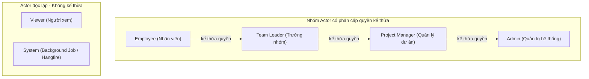

### 2.2 Ma trận Phân quyền Actor – Use Case (UC01 - UC31)

| UC ID | Tên Use Case | Employee | Team Leader | Project Manager | Admin | Viewer | System |
| :---: | :--- | :---: | :---: | :---: | :---: | :---: | :---: |
| **UC01** | Đăng nhập / Đăng xuất | ✔ | ✔ | ✔ | ✔ | ✔ | |
| **UC02** | Tạo Task | | ✔ | ✔ | ✔ | | |
| **UC03** | Xem Danh sách / Chi tiết Task | ✔ | ✔ | ✔ | ✔ | ✔ | |
| **UC04** | Cập nhật thông tin Task | | ✔ | ✔ | ✔ | | |
| **UC05** | Xoá Task | | | ✔ | ✔ | | |
| **UC06** | Tìm kiếm / Lọc / Phân trang | ✔ | ✔ | ✔ | ✔ | ✔ | |
| **UC07** | Gán người thực hiện (Assign) | | ✔ | ✔ | ✔ | | |
| **UC08** | Cập nhật Trạng thái (Status) | ✔ | ✔ | ✔ | ✔ | | |
| **UC09** | Cập nhật Tiến độ (% Progress) | ✔ | ✔ | ✔ | ✔ | | |
| **UC10** | Quản lý SubTask | | ✔ | ✔ | ✔ | | |
| **UC11** | Quản lý Checklist & Items | ✔ | ✔ | ✔ | ✔ | | |
| **UC12** | Viết / Trả lời Bình luận | ✔ | ✔ | ✔ | ✔ | | |
| **UC13** | Upload / Quản lý Tài liệu đính kèm | ✔ | ✔ | ✔ | ✔ | | |
| **UC14** | Xem Lịch sử thay đổi (TaskHistory) | ✔ | ✔ | ✔ | ✔ | ✔ | |
| **UC15** | Submit Review (Trình duyệt) | ✔ | ✔ | ✔ | | | |
| **UC16** | Approve Task (Phê duyệt) | | ✔* | ✔* | ✔* | | |
| **UC17** | Reject Task (Từ chối) | | ✔* | ✔* | ✔* | | |
| **UC18** | Nhận Thông báo (Notification/SignalR) | ✔ | ✔ | ✔ | ✔ | ✔ | |
| **UC19** | Quản lý Dự án (Project CRUD) | | | ✔ | ✔ | | |
| **UC20** | Quản lý Milestone | | | ✔ | ✔ | | |
| **UC21** | Quản lý Thành viên Dự án | | | ✔ | ✔ | | |
| **UC22** | Quản lý Danh mục (Category) | | | | ✔ | | |
| **UC23** | Quản lý Thẻ (Tag) | | ✔ | ✔ | ✔ | | |
| **UC24** | Quản lý User & Phòng ban | | | | ✔ | | |
| **UC25** | Phân quyền Hệ thống (Permissions) | | | | ✔ | | |
| **UC26** | Màn hình Kanban Board (Drag-Drop) | ✔ | ✔ | ✔ | ✔ | ✔ | |
| **UC27** | Màn hình Lịch (Calendar View) | ✔ | ✔ | ✔ | ✔ | ✔ | |
| **UC28** | Màn hình Tổng quan (Dashboard) | ✔ | ✔ | ✔ | ✔ | | |
| **UC29** | Báo cáo & Xuất dữ liệu (Report) | | | ✔ | ✔ | | |
| **UC30** | Sinh Task lặp lại tự động | | | | | | ✔ |
| **UC31** | Quét & Đánh dấu Task quá hạn | | | | | | ✔ |

*\*Ghi chú:* UC16 & UC17 yêu cầu thỏa mãn **Dual Validation Rule** (Sẽ mô tả chi tiết tại Chương 4).

---

## CHƯƠNG 3: CÁC SƠ ĐỒ USE CASE THEO MODULE

### 3.1 Module Task Core (Lõi Nghiệp vụ Công việc)

flowchart LR
    Employee["Employee"]
    TeamLeader["Team Leader"]
    PM["Project Manager"]
    Viewer["Viewer"]

    subgraph MODULE_TASK_CORE ["MODULE TASK CORE"]
        direction TB
        UC01["UC01: Đăng nhập"]
        UC02["UC02: Tạo Task"]
        UC03["UC03: Xem DS/Chi tiết Task"]
        UC04["UC04: Cập nhật Task"]
        UC05["UC05: Xoá Task"]
        UC06["UC06: Search/Filter/Pagination"]
        UC07["UC07: Assign Task"]
        UC08["UC08: Cập nhật Status"]
        UC09["UC09: Cập nhật Progress"]
        UC10["UC10: Quản lý SubTask"]
        UC11["UC11: Quản lý Checklist"]
        UC23["UC23: Quản lý Tag"]
    end

    Employee --> UC01 
    Employee --> UC03 
    Employee --> UC06 
    Employee --> UC08 
    Employee --> UC09 
    Employee --> UC11
    
    TeamLeader --> UC02 
    TeamLeader --> UC04 
    TeamLeader --> UC07 
    TeamLeader --> UC10 
    TeamLeader --> UC23
    
    PM --> UC05 
    PM --> UC23
    
    Viewer --> UC01 
    Viewer --> UC03 
    Viewer --> UC06

    UC02 -.->|"include"| UC01
    UC03 -.->|"include"| UC01
    UC04 -.->|"extend"| UC03
    UC05 -.->|"extend"| UC03
    UC07 -.->|"extend"| UC03
    UC08 -.->|"extend"| UC03
    UC09 -.->|"extend"| UC03
    UC10 -.->|"extend"| UC02
    UC11 -.->|"extend"| UC10
### 3.2 Module Collaboration & Workflow (Cộng tác & Luồng duyệt)

flowchart LR
    Employee["Employee"]
    TeamLeader["Team Leader"]
    PM["Project Manager"]
    Viewer["Viewer"]

    subgraph MODULE_WORKFLOW ["MODULE COLLABORATION & WORKFLOW"]
        direction TB
        UC12["UC12: Comment / Reply"]
        UC13["UC13: Upload Attachment"]
        UC14["UC14: Xem Lịch sử History"]
        UC15["UC15: Submit Review"]
        UC16["UC16: Approve Task"]
        UC17["UC17: Reject Task"]
        UC18["UC18: Nhận Notification"]
    end

    Employee --> UC12 
    Employee --> UC13 
    Employee --> UC14 
    Employee --> UC15 
    Employee --> UC18
    
    TeamLeader --> UC16 
    TeamLeader --> UC17 
    TeamLeader --> UC18
    
    PM --> UC16 
    PM --> UC17
    
    Viewer --> UC14 
    Viewer --> UC18

    UC15 -.->|"extend"| UC08
    UC16 -.->|"include"| UC15
    UC17 -.->|"include"| UC15
    UC18 -.->|"extend"| UC07
### 3.3 Module Project & Organization (Dự án & Quản trị)

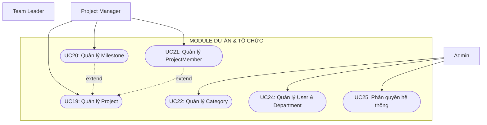

### 3.4 Module Views & Analytics (Hiển thị & Báo cáo)

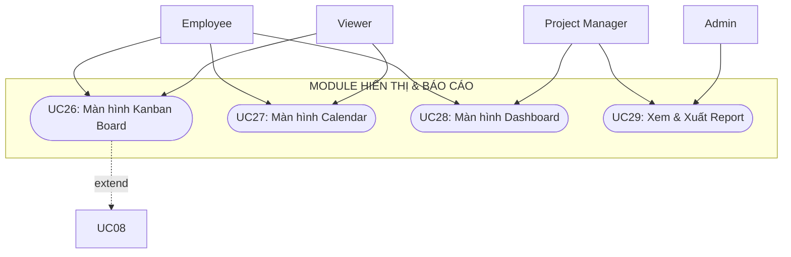

### 3.5 Module System Automation (Tự động hóa Ngầm)

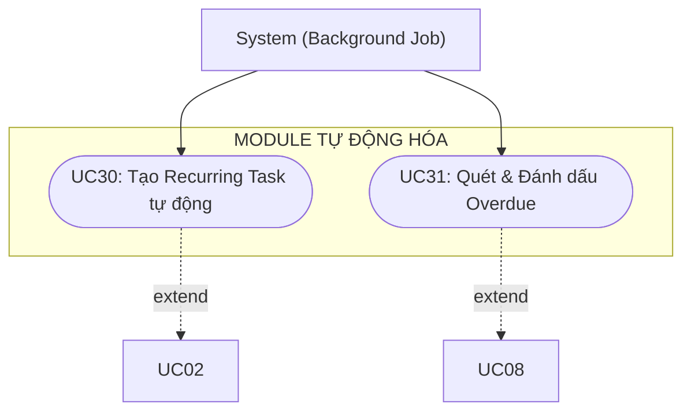

---

## CHƯƠNG 4: ĐẶC TẢ CHI TIẾT CÁC USE CASE TRỌNG YẾU

### 1. UC02 – Tạo Task mới (Create Task)
* **Actor:** Team Leader, Project Manager, Admin.
* **Tiền điều kiện:** Người dùng đã xác thực, có quyền `Pages.Tasks.Create`.
* **Luồng chính:**
  1. Người dùng mở Form "Tạo Task mới" từ giao diện Angular.
  2. Điền các trường: `Title`, `Description`, `Priority`, `StartDate`, `DueDate`, `ProjectId`, `CategoryId`, `ParentTaskId` (nếu có).
  3. Hệ thống validate dữ liệu, tự động sinh `TaskCode` dạng `TASK-YYYY-XXXXX`, khởi tạo `Status = NEW`, gán `CreatedBy = CurrentUserId`.
  4. Hệ thống ghi nhận thông tin vào DB và thêm dòng lịch sử vào `TaskHistories`.
  5. Trả về thông tin Task mới khởi tạo.

### 2. UC07 – Gán Người thực hiện (Assign Task)
* **Actor:** Team Leader, Project Manager, Admin.
* **Luồng chính:**
  1. Người dùng chọn Task và mở chức năng Assign.
  2. Chọn User và chỉ định vai trò trong `TaskUsers`: `ASSIGNEE`, `REVIEWER`, `COLLABORATOR`, hoặc `WATCHER`.
  3. Hệ thống lưu bản ghi `TaskUsers`, tự động cập nhật `Status = ASSIGNED` (nếu Task đang ở trạng thái `NEW`).
  4. Hệ thống kích hoạt `UC18`, tạo bản ghi `AppNotifications` và đẩy SignalR Real-time notification tới thiết bị của Assignee/Reviewer.

### 3. UC08 – Cập nhật Trạng thái (Update Status)
* **Vòng đời trạng thái chuẩn (Lifecycle):**  
  `NEW` $
ightarrow$ `ASSIGNED` $
ightarrow$ `IN_PROGRESS` $
ightarrow$ `REVIEW` $
ightarrow$ `COMPLETED`
* **Ngoại lệ Reject:**  
  `REVIEW` $
ightarrow$ `REJECTED` $
ightarrow$ `IN_PROGRESS` (Sử dụng nút "Resume" thủ công để quay lại làm lại).

### 4. UC15, UC16, UC17 – Quy trình Phê duyệt (Approval Workflow) & Dual Validation Rule

#### A. Trình duyệt Task (UC15 - Submit Review):
* Assignee cập nhật Task hoàn thành $
ightarrow$ gửi yêu cầu duyệt $
ightarrow$ Task chuyển `Status = REVIEW`, tạo bản ghi `TaskApprovals` với `ApprovalStatus = PENDING`.

#### B. Phê duyệt (UC16 - Approve) & Từ chối (UC17 - Reject) — Quy tắc kiểm tra kép (Dual Validation Rule):
Khi một User thực hiện Approve hoặc Reject, Backend API **bắt buộc kiểm tra 2 điều kiện sau**:
1. **Điều kiện Phân công (Contextual Task Role):** Trong bảng `TaskUsers`, người dùng này phải được gán vai trò `RoleType = REVIEWER` trên đúng `TaskId` này.
2. **Điều kiện Cấp bậc Hệ thống (System Rank Authorization):** Cấp bậc/Vai trò hệ thống của người dùng phải $\ge$ `Team Leader` (tức là Team Leader, Project Manager, hoặc Admin).

* **Nếu FAIL 1 trong 2 điều kiện:** API trả về HTTP Exception `403 Forbidden` với thông điệp *"Bạn không có thẩm quyền phê duyệt Task này"*. Trạng thái Task giữ nguyên `REVIEW`.
* **Nếu PASS cả 2 điều kiện:**
  * **Approve (UC16):** Task chuyển `Status = COMPLETED`, `TaskApprovals.ApprovalStatus = APPROVED`, ghi `TaskHistories`, gửi Notification hoàn tất.
  * **Reject (UC17):** Reviewer bắt buộc nhập `Reason`. Task chuyển `Status = REJECTED`, `TaskApprovals.ApprovalStatus = REJECTED` kèm lý do. Gửi Notification phản hồi cho Assignee.

---

## CHƯƠNG 5: CÁC SƠ ĐỒ SEQUENCE DIAGRAM CHI TIẾT

### 5.1 SD_UC02: Luồng Tạo Task mới (UC02 & UC01)

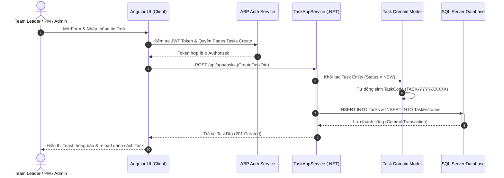

### 5.2 SD_UC07: Luồng Gán Người Thực Hiện & Thông Báo SignalR (UC07 & UC18)

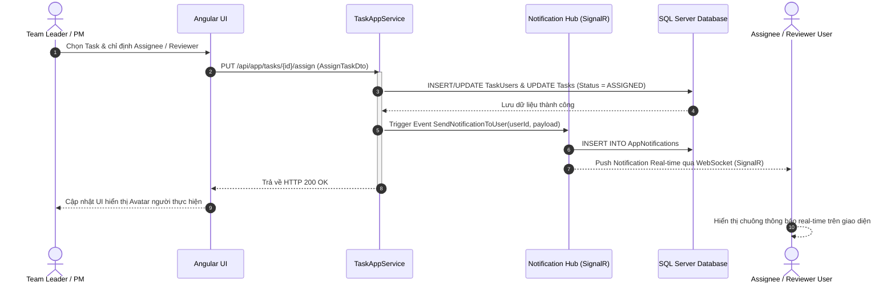

### 5.3 SD_UC15_16_17: Luồng Phê Duyệt Workflow & Dual Validation Check (UC15, 16, 17, 08)

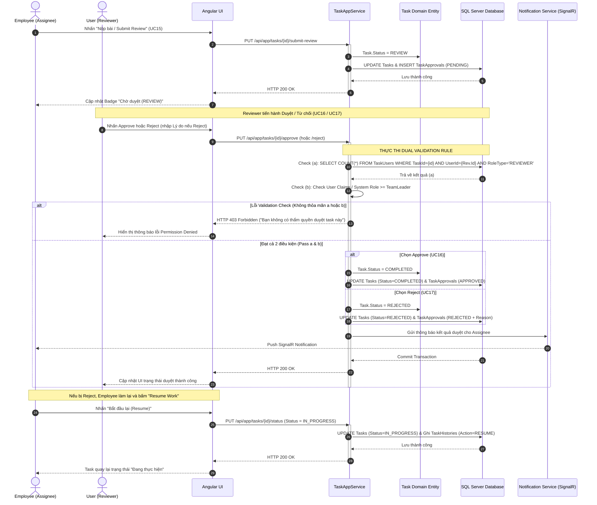

### 5.4 SD_UC19_21: Luồng Quản Lý Dự Án & Thành Viên (UC19, UC20, UC21)

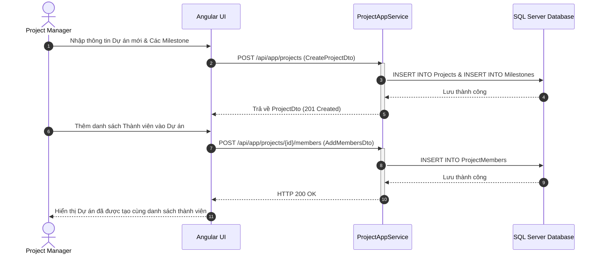

### 5.5 SD_UC26: Luồng Kéo Thả Trạng Thái Trên Kanban Board (UC26 & UC08)

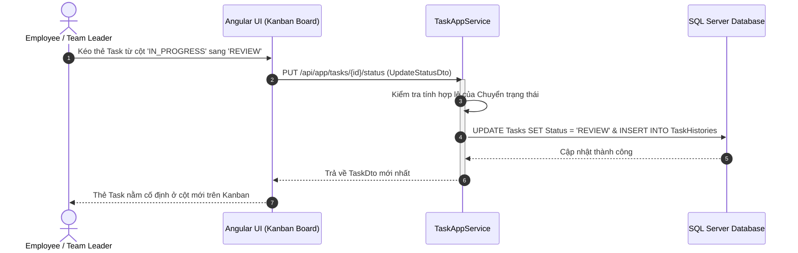

### 5.6 SD_UC30_31: Luồng Tự Động Hóa Background Job (UC30 & UC31)

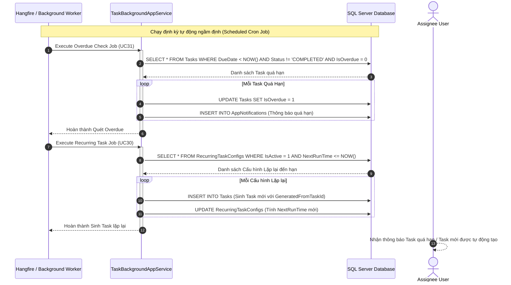

---

## CHƯƠNG 6: SƠ ĐỒ ERD VÀ TỪ ĐIỂN DỮ LIỆU (DATA DICTIONARY)

### 6.1 Sơ đồ Thực thể Mối quan hệ ERD (Chuẩn hóa 3NF)

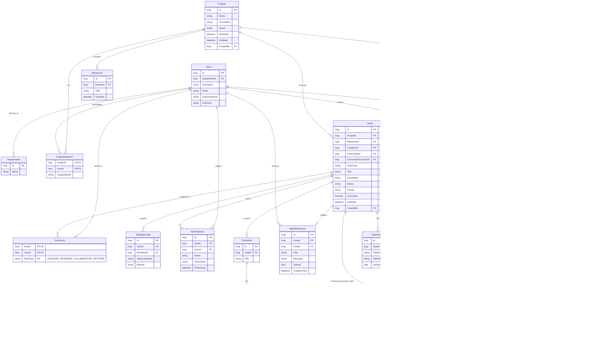

### 6.2 Từ điển Dữ liệu (Data Dictionary) các Bảng Trọng yếu

#### 1. Bảng `Tasks` (Lưu thông tin Công việc)
| Tên Cột | Kiểu Dữ liệu (C# / SQL) | Nullable | Khóa | Mô tả Chi tiết |
| :--- | :--- | :---: | :---: | :--- |
| `Id` | `long` / `BIGINT` | No | PK | Mã khóa chính tự tăng |
| `TaskCode` | `string` / `NVARCHAR(50)` | No | Unique | Mã công việc tự sinh (ví dụ: `TASK-2026-00012`) |
| `Title` | `string` / `NVARCHAR(255)` | No | | Tiêu đề công việc |
| `Description` | `string` / `NVARCHAR(MAX)` | Yes | | Mô tả chi tiết nội dung task |
| `Status` | `string` / `NVARCHAR(30)` | No | | `NEW`, `ASSIGNED`, `IN_PROGRESS`, `REVIEW`, `COMPLETED`, `REJECTED` |
| `Priority` | `string` / `NVARCHAR(20)` | No | | `LOW`, `MEDIUM`, `HIGH`, `URGENT` |
| `IsOverdue` | `bool` / `BIT` | No | | `0`: Đúng hạn, `1`: Quá hạn (Background Job cập nhật) |
| `ProjectId` | `long` / `BIGINT` | No | FK | Liên kết tới dự án (`Projects.Id`) |
| `MilestoneId` | `long?` / `BIGINT` | Yes | FK | Liên kết cột mốc dự án (`Milestones.Id`) |
| `CategoryId` | `long?` / `BIGINT` | Yes | FK | Danh mục phân loại task (`Categories.Id`) |
| `ParentTaskId` | `long?` / `BIGINT` | Yes | FK | Liên kết task cha nếu đây là SubTask (UC10) |
| `GeneratedFromTaskId` | `long?` / `BIGINT` | Yes | FK | Liên kết task gốc nếu được tạo từ Recurring Job (UC30) |
| `DueDate` | `DateTime` / `DATETIME2` | Yes | | Hạn hoàn thành |
| `CreatedBy` | `long` / `BIGINT` | No | FK | Người tạo task (`Users.Id`) |

#### 2. Bảng `TaskUsers` (Phân công Vai trò trên Task)
| Tên Cột | Kiểu Dữ liệu | Nullable | Khóa | Mô tả Chi tiết |
| :--- | :--- | :---: | :---: | :--- |
| `TaskId` | `long` / `BIGINT` | No | PK, FK | Liên kết task (`Tasks.Id`) |
| `UserId` | `long` / `BIGINT` | No | PK, FK | Liên kết người dùng (`Users.Id`) |
| `RoleType` | `string` / `NVARCHAR(30)` | No | PK | `ASSIGNEE` (Người làm), `REVIEWER` (Người duyệt), `COLLABORATOR` (Hỗ trợ), `WATCHER` (Theo dõi) |

#### 3. Bảng `TaskApprovals` (Lịch sử Phê duyệt Workflow)
| Tên Cột | Kiểu Dữ liệu | Nullable | Khóa | Mô tả Chi tiết |
| :--- | :--- | :---: | :---: | :--- |
| `Id` | `long` / `BIGINT` | No | PK | Khóa chính |
| `TaskId` | `long` / `BIGINT` | No | FK | Liên kết task (`Tasks.Id`) |
| `ReviewerId` | `long` / `BIGINT` | No | FK | Người thực hiện duyệt (`Users.Id`) |
| `ApprovalStatus` | `string` / `NVARCHAR(30)` | No | | `PENDING`, `APPROVED`, `REJECTED` |
| `Reason` | `string` / `NVARCHAR(MAX)` | Yes | | Lý do từ chối (bắt buộc khi `REJECTED`) |

---

## CHƯƠNG 7: SƠ ĐỒ LỚP CHI TIẾT (CLASS DIAGRAM) & KIẾN TRÚC ABP

### 7.1 Sơ đồ Class Diagram các Lớp Hệ thống

```mermaid
classDiagram
    direction BR

    class TaskAppService {
        +CreateTaskAsync(CreateTaskDto input) TaskDto
        +AssignTaskAsync(long id, AssignTaskDto input) TaskDto
        +SubmitReviewAsync(long id) TaskDto
        +ApproveTaskAsync(long id) TaskDto
        +RejectTaskAsync(long id, RejectTaskDto input) TaskDto
        +UpdateStatusAsync(long id, UpdateStatusDto input) TaskDto
    }

    class ChecklistAppService {
        +AddChecklistAsync(long taskId, CreateChecklistDto input) ChecklistDto
        +AddChecklistItemAsync(long checklistId, CreateItemDto input) ChecklistItemDto
        +ToggleItemStatusAsync(long itemId) void
    }

    class AttachmentAppService {
        +UploadAttachmentAsync(long taskId, IFormFile file) AttachmentDto
        +DeleteAttachmentAsync(long attachmentId) void
    }

    class CommentAppService {
        +AddCommentAsync(long taskId, CreateCommentDto input) CommentDto
        +ReplyCommentAsync(long commentId, CreateCommentDto input) CommentDto
    }

    class ProjectAppService {
        +CreateProjectAsync(CreateProjectDto input) ProjectDto
        +AddMemberAsync(long projectId, AddMemberDto input) void
    }

    class TaskDomainModel {
        +long Id
        +string TaskCode
        +string Title
        +TaskStatus Status
        +TaskPriority Priority
        +boolean IsOverdue
        +SetStatus(TaskStatus newStatus)
        +SetOverdue(boolean isOverdue)
        +GenerateTaskCode()
    }

    class RecurringTaskConfig {
        +long Id
        +long TaskId
        +string CronExpression
        +datetime NextRunTime
        +boolean IsActive
        +GenerateNextTask() TaskDomainModel
    }

    class TaskApproval {
        +long Id
        +long TaskId
        +long ReviewerId
        +ApprovalStatus ApprovalStatus
        +string Reason
        +Approve()
        +Reject(string reason)
    }

    class NotificationManager {
        +SendNotificationAsync(long userId, long? taskId, string message)
        +SendRealtimeSignalRAsync(long userId, object payload)
    }

    class BackgroundWorker {
        +ExecuteCheckOverdueTasks()
        +ExecuteCreateRecurringTasks()
    }

    TaskAppService --> TaskDomainModel : manages
    TaskAppService --> TaskApproval : creates/updates
    TaskAppService --> NotificationManager : triggers
    ChecklistAppService --> TaskDomainModel : modifies
    AttachmentAppService --> TaskDomainModel : modifies
    CommentAppService --> TaskDomainModel : modifies
    BackgroundWorker --> TaskAppService : invokes jobs
    BackgroundWorker --> RecurringTaskConfig : evaluates
```

---

## CHƯƠNG 8: QUY TRÌNH NGHIỆP VỤ ĐỒNG BỘ TỔNG THỂ (BUSINESS FLOW)

Sơ đồ thể hiện toàn bộ vòng đời khép kín từ khâu khởi tạo Dự án, Phân công Task, Thực hiện, Nộp bài, Kiểm tra Dual Validation, Duyệt/Từ chối, cho đến Tự động hóa ngầm định.

```mermaid
flowchart TD
    Start([Bắt đầu Dự án]) --> PM_Create[PM tạo Project, Milestone & Phân bổ Member]
    PM_Create --> TL_Create[Team Leader/PM tạo Task mới]
    TL_Create --> Assign[Assign Task & phân định vai trò Assignee/Reviewer]
    Assign --> InProgress[Employee bắt đầu làm công việc]

    subgraph Execution ["Nhánh thực thi của Employee"]
        direction TB
        InProgress --> CheckAction{"Hành động thực hiện?"}

        CheckAction -->|"Thực hiện Code/Tài liệu"| NormalWork[Thực hiện công việc chính]
        CheckAction -->|"Tạo Task con"| CreateSub[Tạo/Cập nhật SubTask]
        CheckAction -->|"Checklist"| CreateCheck[Tick ChecklistItem]

        NormalWork --> ProgressCheck
        CreateSub --> UpdateProgress[Hệ thống tự tính toán lại % Tiến độ]
        CreateCheck --> UpdateProgress
        UpdateProgress --> ProgressCheck{"Task đã sẵn sàng nộp?"}

        ProgressCheck -->|"Chưa xong"| CheckAction
        ProgressCheck -->|"Đã sẵn sàng"| SubmitReview[Nhấn Submit Review]
    end

    SubmitReview --> ApprovalDualCheck{"Kiểm tra Dual Validation Rule"}

    ApprovalDualCheck -->|FAIL| DenyAction[Trả về Error HTTP 403 Forbidden]
    DenyAction --> WaitRetry[Chờ Reviewer đủ thẩm quyền thao tác lại]
    WaitRetry -.-> ApprovalDualCheck

    ApprovalDualCheck -->|PASS| ApprovalAction{"Lựa chọn Duyệt hay Từ chối?"}

    ApprovalAction -->|"Phê duyệt"| Complete[Chuyển Status: COMPLETED]
    ApprovalAction -->|"Từ chối"| RejectSet[Chuyển Status: REJECTED kèm Lý do]
    RejectSet --> NotifyEmp[Gửi Notification thông báo cho Employee]
    NotifyEmp --> ResumeWork[Employee bấm Resume Work]
    ResumeWork --> CheckAction

    Complete --> NotifyDone[Gửi Notification hoàn thành cho các bên]
    NotifyDone --> End([Kết thúc Vòng đời Task])

    subgraph Background ["System Background Jobs"]
        direction TB
        Job[Background Worker quét định kỳ] --> Overdue{"Có Task quá hạn?"}
        Overdue -->|Đúng| Mark[Set IsOverdue = true & Gửi Notification]
        Overdue -->|Chưa| Job

        Job --> Recurring{Có RecurringTaskConfig đến kỳ?}
        Recurring -->|Đúng| CreateRecur[Tự động sinh Task mới]
        Recurring -->|Chưa| Job
    end

    