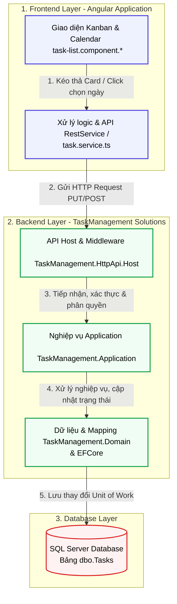

```mermaid
graph TD
    classDef frontend fill:#eef2ff,stroke:#4f46e5,stroke-width:2px,color:#000000;
    classDef backend fill:#f0fdf4,stroke:#16a34a,stroke-width:2px,color:#000000;
    classDef db fill:#fef2f2,stroke:#dc2626,stroke-width:2px,color:#000000;

    subgraph Frontend [1. Frontend Layer - Angular Application]
        UI[Giao diện Kanban & Calendar <br/> task-list.component.*]
        Service[Xử lý logic & API <br/> RestService / task.service.ts]
        
        UI -->|1. Kéo thả Card / Click chọn ngày| Service
    end

    subgraph Backend [2. Backend Layer - TaskManagement Solutions]
        Host[API Host & Middleware <br/> TaskManagement.HttpApi.Host]
        App[Nghiệp vụ Application <br/> TaskManagement.Application]
        DomainEF[Dữ liệu & Mapping <br/> TaskManagement.Domain & EFCore]

        Host -->|3. Tiếp nhận, xác thực & phân quyền| App
        App -->|4. Xử lý nghiệp vụ, cập nhật trạng thái| DomainEF
    end

    subgraph Database [3. Database Layer]
        DB[(SQL Server Database <br/> Bảng dbo.Tasks)]
    end

    Service -->|2. Gửi HTTP Request PUT/POST| Host
    DomainEF -->|5. Lưu thay đổi Unit of Work| DB

    class UI,Service frontend;
    class Host,App,DomainEF backend;
    class DB db;
```