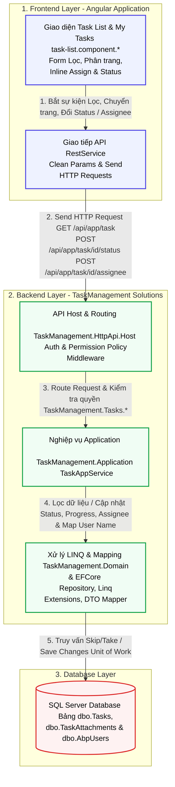

```mermaid
graph TD
    classDef frontend fill:#eef2ff,stroke:#4f46e5,stroke-width:2px,color:#000000;
    classDef backend fill:#f0fdf4,stroke:#16a34a,stroke-width:2px,color:#000000;
    classDef db fill:#fef2f2,stroke:#dc2626,stroke-width:2px,color:#000000;

    subgraph Frontend [1. Frontend Layer - Angular Application]
        UI[Giao diện Task List & My Tasks <br/> task-list.component.* <br/> Form Lọc, Phân trang, Inline Assign & Status]
        Service[Giao tiếp API <br/> RestService <br/> Clean Params & Send HTTP Requests]
        
        UI -->|1. Bắt sự kiện Lọc, Chuyển trang, Đổi Status / Assignee| Service
    end

    subgraph Backend [2. Backend Layer - TaskManagement Solutions]
        Host[API Host & Routing <br/> TaskManagement.HttpApi.Host <br/> Auth & Permission Policy Middleware]
        App[Nghiệp vụ Application <br/> TaskManagement.Application <br/> TaskAppService]
        DomainEF[Xử lý LINQ & Mapping <br/> TaskManagement.Domain & EFCore <br/> Repository, Linq Extensions, DTO Mapper]

        Host -->|3. Route Request & Kiểm tra quyền TaskManagement.Tasks.*| App
        App -->|4. Lọc dữ liệu / Cập nhật Status, Progress, Assignee & Map User Name| DomainEF
    end

    subgraph Database [3. Database Layer]
        DB[(SQL Server Database <br/> Bảng dbo.Tasks, dbo.TaskAttachments & dbo.AbpUsers)]
    end

    Service -->|2. Send HTTP Request <br/> GET /api/app/task <br/> POST /api/app/task/id/status <br/> POST /api/app/task/id/assignee| Host
    DomainEF -->|5. Truy vấn Skip/Take / Save Changes Unit of Work| DB

    class UI,Service frontend;
    class Host,App,DomainEF backend;
    class DB db;
```