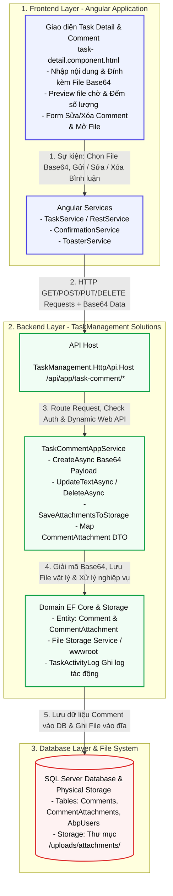

```mermaid
graph TD
    classDef frontend fill:#eef2ff,stroke:#4f46e5,stroke-width:2px,color:#000000;
    classDef backend fill:#f0fdf4,stroke:#16a34a,stroke-width:2px,color:#000000;
    classDef db fill:#fef2f2,stroke:#dc2626,stroke-width:2px,color:#000000;

    subgraph Frontend [1. Frontend Layer - Angular Application]
        UI[Giao diện Task Detail & Comment <br/> task-detail.component.html <br/> - Nhập nội dung & Đính kèm File Base64 <br/> - Preview file chờ & Đếm số lượng <br/> - Form Sửa/Xóa Comment & Mở File]
        Service[Angular Services <br/> - TaskService / RestService <br/> - ConfirmationService <br/> - ToasterService]
        
        UI -->|1. Sự kiện: Chọn File Base64, Gửi / Sửa / Xóa Bình luận| Service
    end

    subgraph Backend [2. Backend Layer - TaskManagement Solutions]
        Host[API Host <br/> TaskManagement.HttpApi.Host <br/> /api/app/task-comment/*]
        App[TaskCommentAppService <br/> - CreateAsync Base64 Payload <br/> - UpdateTextAsync / DeleteAsync <br/> - SaveAttachmentsToStorage <br/> - Map CommentAttachment DTO]
        DomainEF[Domain EF Core & Storage <br/> - Entity: Comment & CommentAttachment <br/> - File Storage Service / wwwroot <br/> - TaskActivityLog Ghi log tác động]

        Host -->|3. Route Request, Check Auth & Dynamic Web API| App
        App -->|4. Giải mã Base64, Lưu File vật lý & Xử lý nghiệp vụ| DomainEF
    end

    subgraph Database [3. Database Layer & File System]
        DB[(SQL Server Database & Physical Storage <br/> - Tables: Comments, CommentAttachments, AbpUsers <br/> - Storage: Thư mục /uploads/attachments/)]
    end

    Service -->|2. HTTP GET/POST/PUT/DELETE Requests + Base64 Data| Host
    DomainEF -->|5. Lưu dữ liệu Comment vào DB & Ghi File vào đĩa| DB

    class UI,Service frontend;
    class Host,App,DomainEF backend;
    class DB db;
```