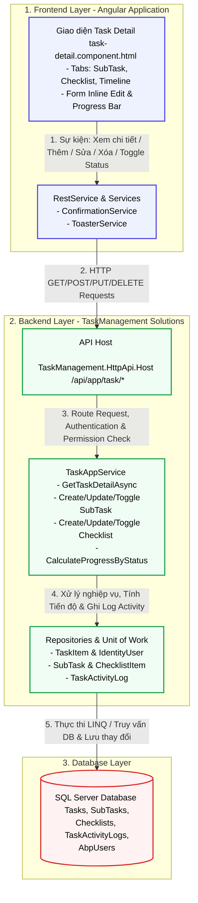

```mermaid
graph TD
    classDef frontend fill:#eef2ff,stroke:#4f46e5,stroke-width:2px,color:#000000;
    classDef backend fill:#f0fdf4,stroke:#16a34a,stroke-width:2px,color:#000000;
    classDef db fill:#fef2f2,stroke:#dc2626,stroke-width:2px,color:#000000;

    subgraph Frontend [1. Frontend Layer - Angular Application]
        UI[Giao diện Task Detail <br/> task-detail.component.html <br/> - Tabs: SubTask, Checklist, Timeline <br/> - Form Inline Edit & Progress Bar]
        Service[RestService & Services <br/> - ConfirmationService <br/> - ToasterService]
        
        UI -->|1. Sự kiện: Xem chi tiết / Thêm / Sửa / Xóa / Toggle Status| Service
    end

    subgraph Backend [2. Backend Layer - TaskManagement Solutions]
        Host[API Host <br/> TaskManagement.HttpApi.Host <br/> /api/app/task/*]
        App[TaskAppService <br/> - GetTaskDetailAsync <br/> - Create/Update/Toggle SubTask <br/> - Create/Update/Toggle Checklist <br/> - CalculateProgressByStatus]
        DomainEF[Repositories & Unit of Work <br/> - TaskItem & IdentityUser <br/> - SubTask & ChecklistItem <br/> - TaskActivityLog]

        Host -->|3. Route Request, Authentication & Permission Check| App
        App -->|4. Xử lý nghiệp vụ, Tính Tiến độ & Ghi Log Activity| DomainEF
    end

    subgraph Database [3. Database Layer]
        DB[(SQL Server Database <br/> Tasks, SubTasks, Checklists, <br/> TaskActivityLogs, AbpUsers)]
    end

    Service -->|2. HTTP GET/POST/PUT/DELETE Requests| Host
    DomainEF -->|5. Thực thi LINQ / Truy vấn DB & Lưu thay đổi| DB

    class UI,Service frontend;
    class Host,App,DomainEF backend;
    class DB db;
```