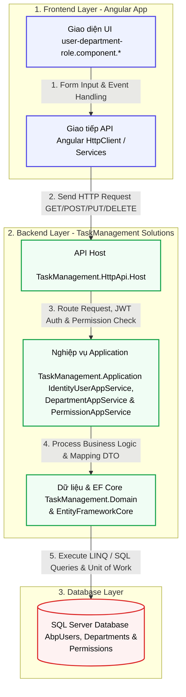

```mermaid
graph TD
    classDef frontend fill:#eef2ff,stroke:#4f46e5,stroke-width:2px,color:#000000;
    classDef backend fill:#f0fdf4,stroke:#16a34a,stroke-width:2px,color:#000000;
    classDef db fill:#fef2f2,stroke:#dc2626,stroke-width:2px,color:#000000;

    subgraph Frontend [1. Frontend Layer - Angular App]
        UI[Giao diện UI <br/> user-department-role.component.*]
        Service[Giao tiếp API <br/> Angular HttpClient / Services]
        
        UI -->|1. Form Input & Event Handling| Service
    end

    subgraph Backend [2. Backend Layer - TaskManagement Solutions]
        Host[API Host <br/> TaskManagement.HttpApi.Host]
        App[Nghiệp vụ Application <br/> TaskManagement.Application <br/> IdentityUserAppService, DepartmentAppService & PermissionAppService]
        DomainEF[Dữ liệu & EF Core <br/> TaskManagement.Domain & EntityFrameworkCore]

        Host -->|3. Route Request, JWT Auth & Permission Check| App
        App -->|4. Process Business Logic & Mapping DTO| DomainEF
    end

    subgraph Database [3. Database Layer]
        DB[(SQL Server Database <br/> AbpUsers, Departments & Permissions)]
    end

    Service -->|2. Send HTTP Request GET/POST/PUT/DELETE| Host
    DomainEF -->|5. Execute LINQ / SQL Queries & Unit of Work| DB

    class UI,Service frontend;
    class Host,App,DomainEF backend;
    class DB db;
```