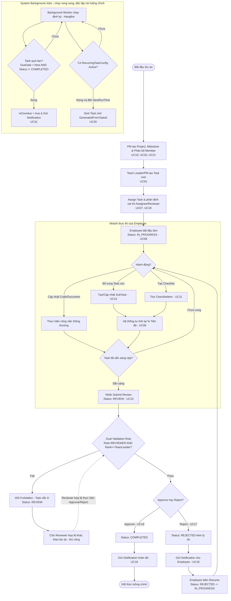

##  QUY TRÌNH NGHIỆP VỤ ĐỒNG BỘ (BUSINESS FLOW)
### Luồng vận hành tổng thể của hệ thống được mô tả trực quan qua sơ đồ hoạt động (Activity Diagram), thể hiện toàn bộ vòng đời từ khâu khởi tạo dự án, phân công, thực hiện công việc cho đến quy trình phê duyệt khép kín và các tác vụ tự động hóa ngầm:

