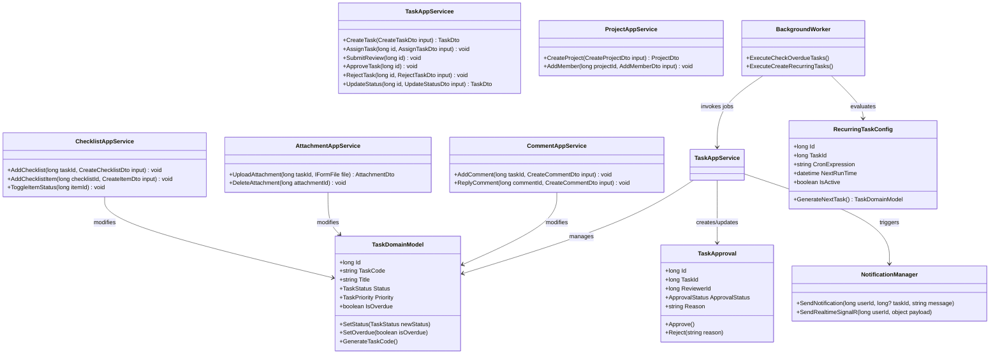

##  SƠ ĐỒ LỚP CHI TIẾT (CLASS DIAGRAM)
### Mô hình lớp tuân thủ kiến trúc phân tầng của ABP Framework (Domain Model, AppService, DTO) 

```mermaid
classDiagram
    direction BR
    class TaskAppServicee {
        +CreateTask(CreateTaskDto input) TaskDto
        +AssignTask(long id, AssignTaskDto input) void
        +SubmitReview(long id) void
        +ApproveTask(long id) void
        +RejectTask(long id, RejectTaskDto input) void
        +UpdateStatus(long id, UpdateStatusDto input) TaskDto
    }

    class ChecklistAppService {
        +AddChecklist(long taskId, CreateChecklistDto input) void
        +AddChecklistItem(long checklistId, CreateItemDto input) void
        +ToggleItemStatus(long itemId) void
    }

    class AttachmentAppService {
        +UploadAttachment(long taskId, IFormFile file) AttachmentDto
        +DeleteAttachment(long attachmentId) void
    }

    class CommentAppService {
        +AddComment(long taskId, CreateCommentDto input) void
        +ReplyComment(long commentId, CreateCommentDto input) void
    }

    class ProjectAppService {
        +CreateProject(CreateProjectDto input) ProjectDto
        +AddMember(long projectId, AddMemberDto input) void
    }

    class TaskDomainModel {
        +long Id
        +string TaskCode
        +string Title
        +TaskStatus Status
        +TaskPriority Priority
        +boolean IsOverdue
        +SetStatus(TaskStatus newStatus)
        +SetOverdue(boolean isOverdue)
        +GenerateTaskCode()
    }

    class RecurringTaskConfig {
        +long Id
        +long TaskId
        +string CronExpression
        +datetime NextRunTime
        +boolean IsActive
        +GenerateNextTask() TaskDomainModel
    }

    class TaskApproval {
        +long Id
        +long TaskId
        +long ReviewerId
        +ApprovalStatus ApprovalStatus
        +string Reason
        +Approve()
        +Reject(string reason)
    }

    class NotificationManager {
        +SendNotification(long userId, long? taskId, string message)
        +SendRealtimeSignalR(long userId, object payload)
    }

    class BackgroundWorker {
        +ExecuteCheckOverdueTasks()
        +ExecuteCreateRecurringTasks()
    }

    TaskAppService --> TaskDomainModel : manages
    TaskAppService --> TaskApproval : creates/updates
    TaskAppService --> NotificationManager : triggers
    ChecklistAppService --> TaskDomainModel : modifies
    AttachmentAppService --> TaskDomainModel : modifies
    CommentAppService --> TaskDomainModel : modifies
    BackgroundWorker --> TaskAppService : invokes jobs
    BackgroundWorker --> RecurringTaskConfig : evaluates
```