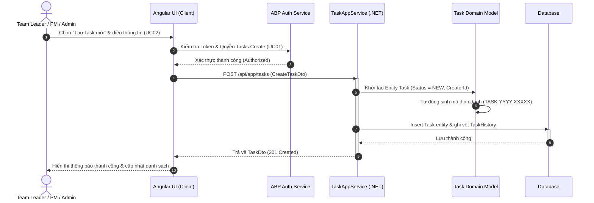
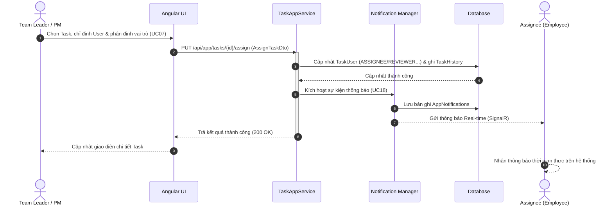
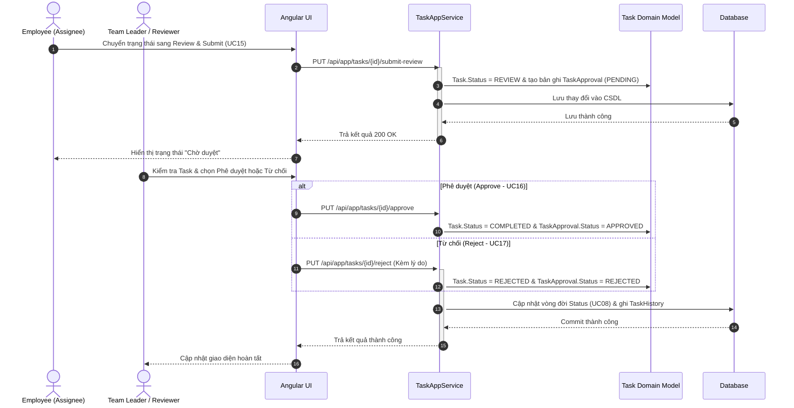
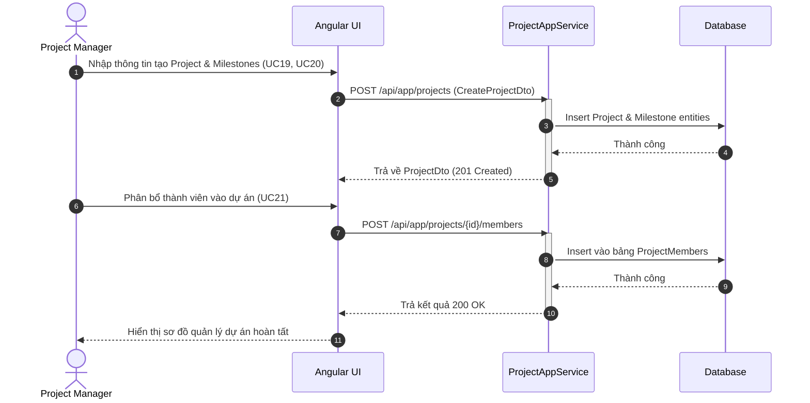
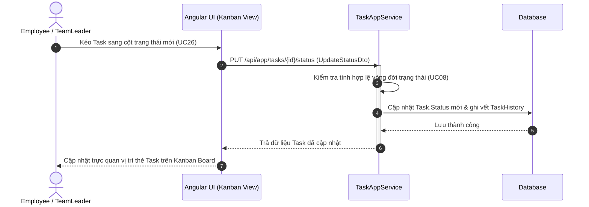

# TÀI LIỆU PHÂN TÍCH VÀ THIẾT KẾ HỆ THỐNG: SEQUENCE DIAGRAM CHI TIẾT
**Dự án:** Hệ thống Quản lý Công việc (Task Management – ABP .NET + Angular)  

---

## 1. SEQUENCE DIAGRAM – LUỒNG TẠO TASK MỚI (UC02 & UC01)

## 2. SEQUENCE DIAGRAM – LUỒNG GÁN NGƯỜI THỰC HIỆN & THÔNG BÁO (UC07 & UC18)

## 3. SEQUENCE DIAGRAM – LUỒNG PHÊ DUYỆT WORKFLOW (UC15, UC16, UC17 & UC08)

## 4. SEQUENCE DIAGRAM – LUỒNG QUẢN LÝ DỰ ÁN & THÀNH VIÊN (UC19, UC20, UC21)

## 5. SEQUENCE DIAGRAM – LUỒNG KANBAN KÉO THẢ TRẠNG THÁI (UC26 & UC08)

## 6. SEQUENCE DIAGRAM – LUỒNG TỰ ĐỘNG HÓA BACKGROUND JOB (UC30 & UC31)
```mermaid
sequenceDiagram
    autonumber
    participant Job as Background Worker (System)
    participant AppSrv as Task Background Service
    participant DB as Database
    actor User as Assignee / Manager

    Note over Job, DB: Thực thi định kỳ tự động (Hangfire / ABP Background Job)
    
    Job->>AppSrv: Quét Task quá hạn (UC31)
    activate AppSrv
    AppSrv->>DB: SELECT * WHERE DueDate < Now AND Status != COMPLETED
    DB-->>AppSrv: Trả về danh sách Task quá hạn
    
    loop Xử lý từng Task quá hạn
        AppSrv->>DB: Cập nhật Status = OVERDUE & Tạo bản ghi Notification
    end
    AppSrv-->>Job: Hoàn thành quét quá hạn
    deactivate AppSrv
    
    Job->>AppSrv: Kiểm tra cấu hình lặp lại (UC30)
    activate AppSrv
    AppSrv->>DB: Tự động sinh Task mới theo chu kỳ (Recurring Task)
    DB-->>AppSrv: Lưu Task mới thành công
    deactivate AppSrv

    User-->>User: Nhận thông báo Task Overdue / Task mới tự động