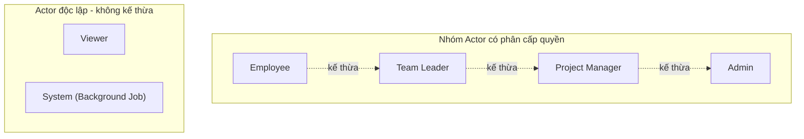
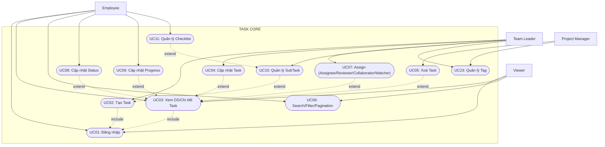
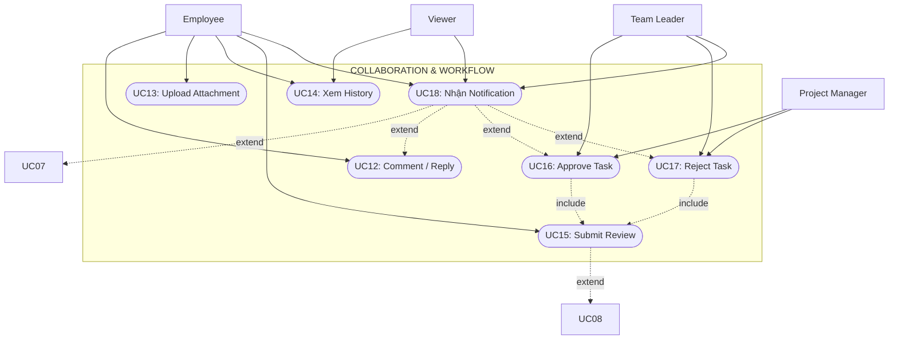
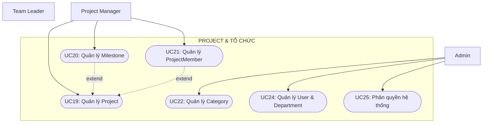
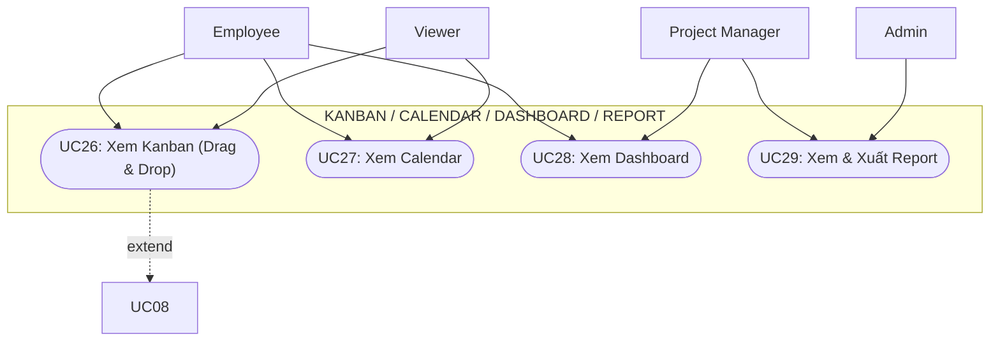
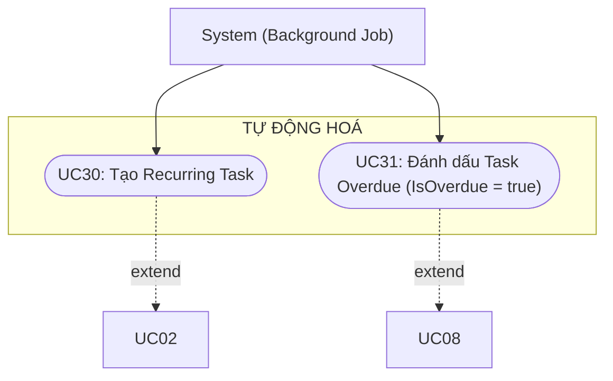

# TÀI LIỆU PHÂN TÍCH VÀ THIẾT KẾ HỆ THỐNG: SƠ ĐỒ USE CASE & QUY TRÌNH NGHIỆP VỤ
**Dự án:** Hệ thống Quản lý Công việc (Task Management – ABP .NET + Angular)
**Phạm vi:** Tài liệu chuyển đổi chi tiết từ yêu cầu hệ thống sang các sơ đồ phân tích kỹ thuật chuẩn Mermaid và quy trình nghiệp vụ.

---

## PHẦN 1: TỔNG QUAN VỀ TÁC NHÂN (ACTOR) VÀ PHÂN QUYỀN

Hệ thống định nghĩa 5 nhóm Actor chính tương ứng với các cấp độ phân quyền trong ABP Framework, cùng với một System Actor chuyên trách các tác vụ nền tự động (độc lập hoàn toàn, không tham gia vào cây kế thừa quyền):

1. **Employee (Nhân viên):** Actor cơ sở, có quyền xem Task được giao, cập nhật tiến độ, trạng thái, bình luận, upload tài liệu và submit review.
2. **Team Leader (Trưởng nhóm):** Kế thừa toàn bộ quyền của Employee, đồng thời có thể tạo/giao task, review task và theo dõi khối lượng công việc của cả team.
3. **Project Manager (Quản lý dự án):** Kế thừa quyền của Team Leader, chịu trách nhiệm quản lý toàn diện Project, Milestone, phân bổ nguồn lực, phê duyệt và xem báo cáo.
4. **Admin (Quản trị viên hệ thống):** Cấp độ cao nhất, kế thừa Project Manager và nắm giữ toàn quyền quản trị người dùng, phòng ban, danh mục, phân quyền hệ thống.
5. **Viewer (Người xem):** Actor độc lập với quyền hạn chế, chỉ có thể xem dữ liệu mà không được phép tác động hay chỉnh sửa.
6. **System (Hệ thống / Background Job):** Actor ngầm định thực thi tự động các tác vụ định kỳ như gửi thông báo, đánh dấu quá hạn, hoặc tạo Task lặp lại.

### Sơ đồ quan hệ phân cấp Actor

## PHẦN 2: CÁC SƠ ĐỒ USE CASE THEO MODULE (CHUẨN MERMAID)

### 2.1. Module Task Core (Lõi nghiệp vụ công việc)

### 2.2. Module Cộng tác & Workflow (Quy trình phê duyệt)

### 2.3. Module Project / Danh mục & Tổ chức

### 2.4. Module Hiển thị nâng cao & Báo cáo

### 2.5. Module Tự động hoá (System Actor)

---

## PHẦN 3: ĐẶC TẢ CHI TIẾT CÁC USE CASE TRỌNG YẾU

### 1. UC02 – Tạo Task
* **Actor:** Team Leader, Project Manager, Admin
* **Include:** UC01 (Đăng nhập)
* **Tiền điều kiện:** Người dùng đã xác thực hệ thống, sở hữu quyền `Tasks.Create`.
* **Luồng chính:**
  1. Người dùng chọn chức năng "Tạo Task mới" trên giao diện.
  2. Điền đầy đủ thông tin: Tiêu đề (`Title`), Mô tả (`Description`), Loại task (`TaskType`), Mức độ ưu tiên (`Priority`), Thời gian (`StartDate/DueDate`), Danh mục (`Category`), Dự án liên quan (`Project`), và Task cha nếu là công việc con (`ParentTaskId`).
  3. Hệ thống tự động sinh mã định danh dạng `TASK-YYYY-XXXXX`, khởi tạo trạng thái `Status = NEW`, và gán `CreatorId` tương ứng.
  4. Lưu trữ bản ghi vào cơ sở dữ liệu và ghi vết lịch sử vào `TaskHistory`.

### 2. UC07 – Gán người thực hiện (Assign)
* **Actor:** Team Leader, Project Manager, Admin
* **Extend:** UC03 (Xem chi tiết Task)
* **Luồng chính:**
  1. Tại màn hình chi tiết Task, người có quyền chọn chức năng "Assign".
  2. Lựa chọn tài khoản người dùng và phân định vai trò cụ thể trong bảng `TaskUser`: `ASSIGNEE`, `REVIEWER`, `COLLABORATOR`, hoặc `WATCHER`.
  3. Hệ thống tự động chuyển trạng thái Task thành `ASSIGNED` nếu đây là lần gán `Assignee` đầu tiên.
  4. Kích hoạt UC18 để gửi thông báo thời gian thực.

### 3. UC08 – Cập nhật trạng thái Task (UpdateStatus)
* **Actor:** Employee (Assignee), Team Leader, Project Manager, Admin
* **Vòng đời chuẩn:** `NEW -> ASSIGNED -> IN_PROGRESS -> REVIEW -> COMPLETED`
* **Ngoại lệ:** `REVIEW -> REJECTED -> IN_PROGRESS` (2 bước riêng biệt, `REJECTED` là trạng thái được lưu thật, không tự động chuyển tiếp)

### 4. UC15, UC16, UC17 – Luồng Phê duyệt (Workflow)
* **Submit Review (UC15):**
  * Actor: Employee (Assignee), Team Leader, Project Manager
  * Assignee chuyển trạng thái sang `REVIEW`, tạo bản ghi `TaskApproval` với `ApprovalStatus = PENDING`, ghi vết `TaskHistory` (Action = SUBMIT_REVIEW).
* **Approve Task (UC16):**
  * Actor: Team Leader, Project Manager, Admin
  * **Điều kiện tiền đề (Dual Validation Rule) — bắt buộc thỏa mãn cả hai:**
    * (a) User được gán `RoleType = REVIEWER` trên chính Task đó trong bảng `TaskUser`.
    * (b) User có cấp bậc hệ thống ≥ Team Leader.
  * Nếu không thỏa cả (a) và (b) → hệ thống trả lỗi `403 Forbidden`, Task giữ nguyên `Status = REVIEW`.
  * Nếu thỏa mãn: Reviewer duyệt → `Task.Status = COMPLETED`, `TaskApproval.ApprovalStatus = APPROVED`, ghi `TaskHistory` (Action = APPROVE), kích hoạt UC18.
* **Reject Task (UC17):**
  * Actor: Team Leader, Project Manager, Admin
  * Áp dụng **cùng Dual Validation Rule** như UC16.
  * Reviewer từ chối kèm lý do → `Task.Status = REJECTED`, `TaskApproval.ApprovalStatus = REJECTED` (kèm `Reason`), ghi `TaskHistory` (Action = REJECT), kích hoạt UC18.
  * Sau đó, Employee tự thao tác chuyển `REJECTED -> IN_PROGRESS` (một bước riêng, không tự động) để tiếp tục sửa Task.

---

## PHẦN 4: MA TRẬN QUAN HỆ ACTOR – USE CASE

| Use Case | Employee | Team Leader | Project Manager | Admin | Viewer |
| :--- | :---: | :---: | :---: | :---: | :---: |
| **UC01 Đăng nhập / Đăng xuất** | ✔ | ✔ | ✔ | ✔ | ✔ |
| **UC02 Tạo Task** | | ✔ | ✔ | ✔ | |
| **UC03 Xem DS / Chi tiết Task** | ✔ | ✔ | ✔ | ✔ | ✔ |
| **UC04 Cập nhật Task** | | ✔ | ✔ | ✔ | |
| **UC05 Xoá Task** | | | ✔ | ✔ | |
| **UC06 Search / Filter / Pagination** | ✔ | ✔ | ✔ | ✔ | ✔ |
| **UC07 Gán người thực hiện (Assign)** | | ✔ | ✔ | ✔ | |
| **UC08 Cập nhật trạng thái (Status)** | ✔ | ✔ | ✔ | ✔ | |
| **UC09 Cập nhật tiến độ (Progress)** | ✔ | ✔ | ✔ | ✔ | |
| **UC10 Quản lý SubTask** | | ✔ | ✔ | ✔ | |
| **UC11 Quản lý Checklist** | ✔ | ✔ | ✔ | ✔ | |
| **UC12 Thêm / Trả lời Comment** | ✔ | ✔ | ✔ | ✔ | |
| **UC13 Upload / Quản lý Attachment** | ✔ | ✔ | ✔ | ✔ | |
| **UC14 Xem lịch sử thay đổi (History)** | ✔ | ✔ | ✔ | ✔ | ✔ |
| **UC15 Submit Review** | ✔ | ✔ | ✔ | | |
| **UC16 Approve Task** | | ✔ | ✔ | ✔ | |
| **UC17 Reject Task** | | ✔ | ✔ | ✔ | |
| **UC18 Nhận Notification** | ✔ | ✔ | ✔ | ✔ | ✔ |
| **UC19 Quản lý Project (CRUD)** | | | ✔ | ✔ | |
| **UC20 Quản lý Milestone** | | | ✔ | ✔ | |
| **UC21 Quản lý ProjectMember** | | | ✔ | ✔ | |
| **UC22 Quản lý Category** | | | | ✔ | |
| **UC23 Quản lý Tag** | | ✔ | ✔ | ✔ | |
| **UC24 Quản lý User & Department** | | | | ✔ | |
| **UC25 Phân quyền hệ thống (Permission)** | | | | ✔ | |
| **UC26 Xem Kanban Board** | ✔ | ✔ | ✔ | ✔ | ✔ |
| **UC27 Xem Calendar** | ✔ | ✔ | ✔ | ✔ | ✔ |
| **UC28 Xem Dashboard** | ✔ | ✔ | ✔ | ✔ | |
| **UC29 Xem & Xuất Report** | | | ✔ | ✔ | |
| **UC30 Tạo Recurring Task** | *System* | *System* | *System* | *System* | |
| **UC31 Đánh dấu Overdue tự động** | *System* | *System* | *System* | *System* | |
